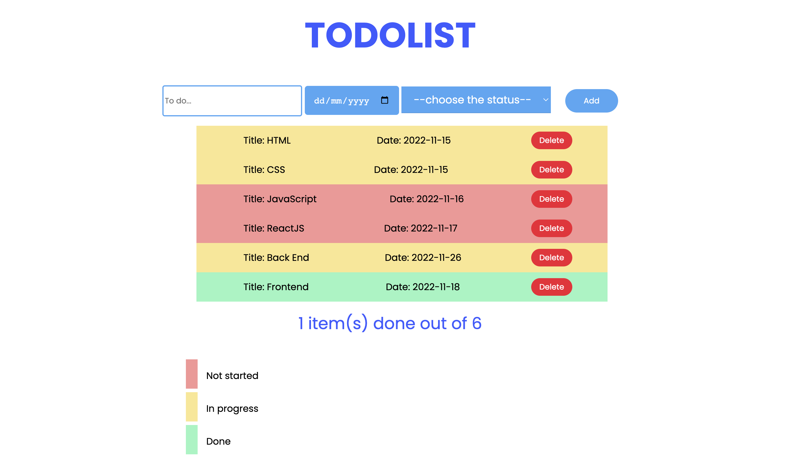
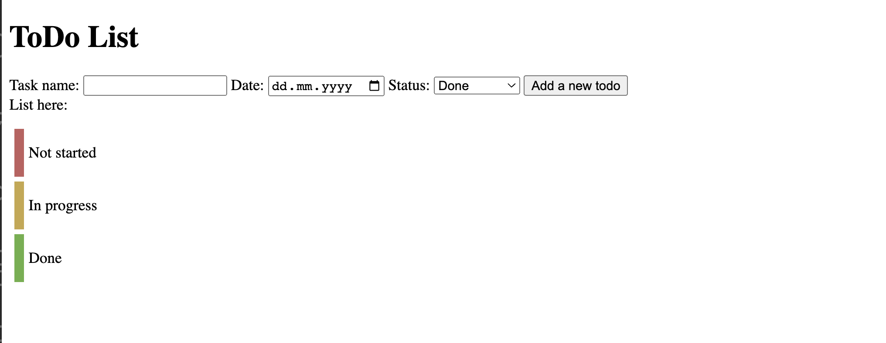
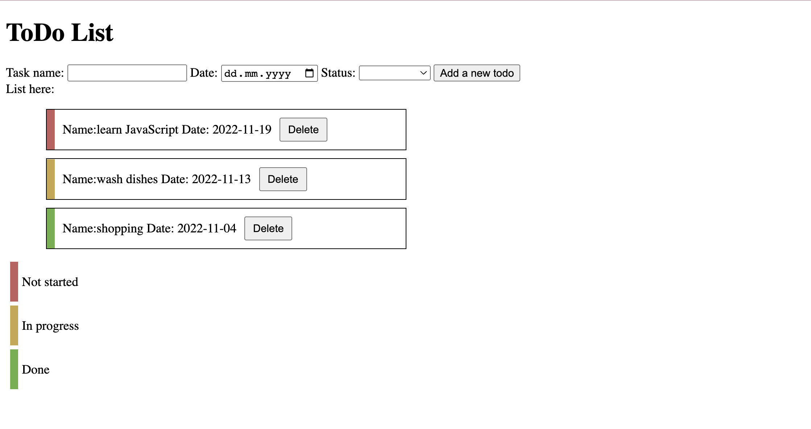

# Please create a To do list

## Requirements:

1. A to-do item should have name, date and status
2. The to-do name is unique
3. Validation: when the user did NOT insert any name or date it should shown a warning
4. The color of to-do item should match the status color (for example: not started status had red color)
5. The user can delete the to-do item
6. Styling is up to you :)

## Update the deploy link here:

still need to fix

- Checking the title already exist or not
- Set new array after delete

## Here is a sample:

Todo form

Todo list

